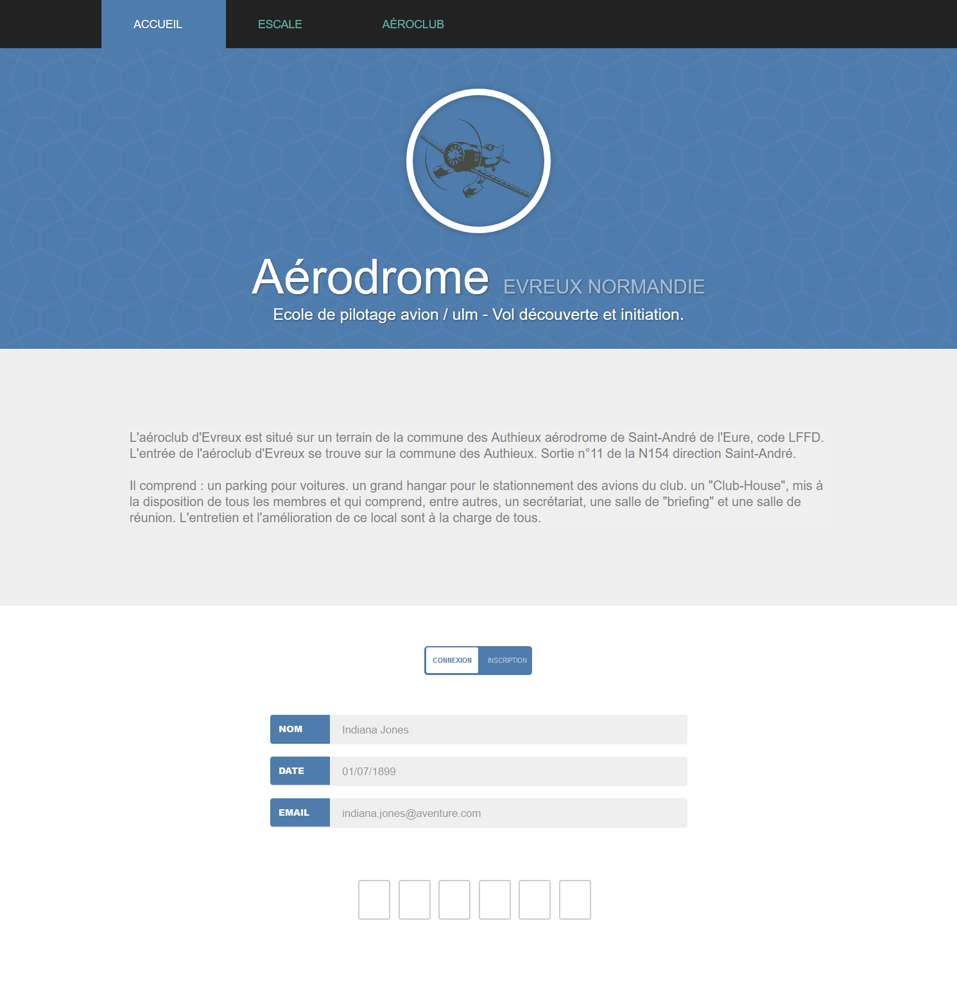

# Aérodrome d'Évreux Normandie (AEN)

Refonte totale du système informatique d'AEN, du fait qu'il ne soit plus aux normes et qu'il correspond plus à une mise en oeuvre familiale que professionnelle. La nouvelle structure est basée sur du matériel Cisco.

Il nous a aussi été demandé à côté :  

- De développer le [site web](web/) de l’entreprise en respectant la charte graphique et les fonctionnalités spécifiées par le client 
- De développer une [application de récupération des données météos](api_weather/) (en C) 
- De développer un [logiciel d’export des activités mensuelles](export/) de l’aéroclub pour le service comptabilité (en JAVA) 
- De développer un [planning de l’utilisation des avions](planning/) de l’aéroclub (en node.js) 
- De configurer un [serveur](server/) (node.js) 



## Installation

```
chmod +x setup/boot.sh
setup/boot.sh option
```

Remarque :
Option peut correspondre à :  

- "global" : installation de tous les modules 
- "server" : installation de tous les modules insdispensables à la création du serveur 
- "weather" : transfère de la partie météo et configuration de cron 
- "web" : transfère de la partie web, configuration du serveur et du smtp 
- "export" : installation de jdk 
